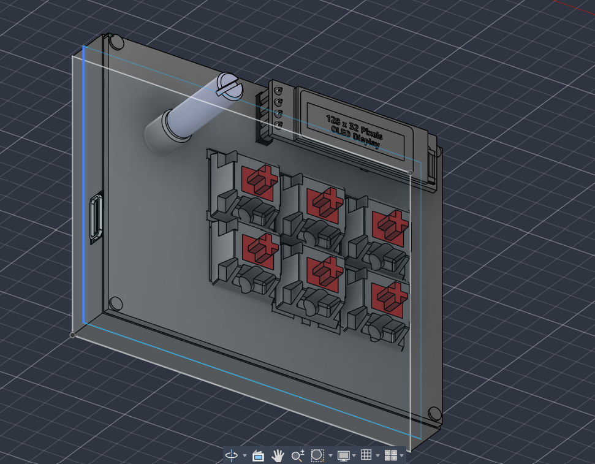
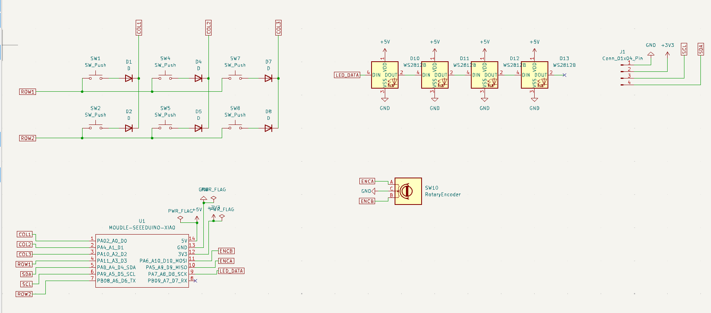
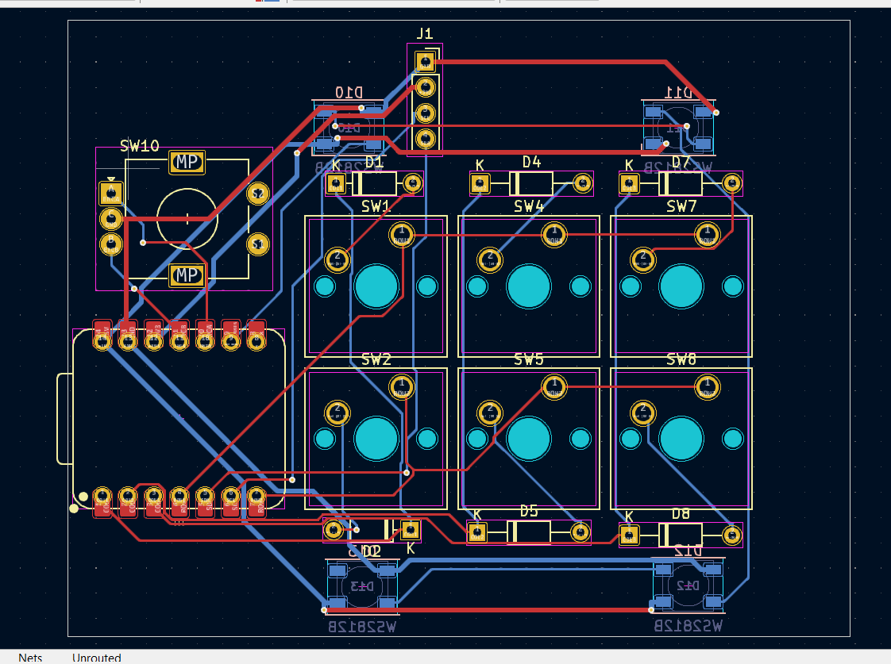
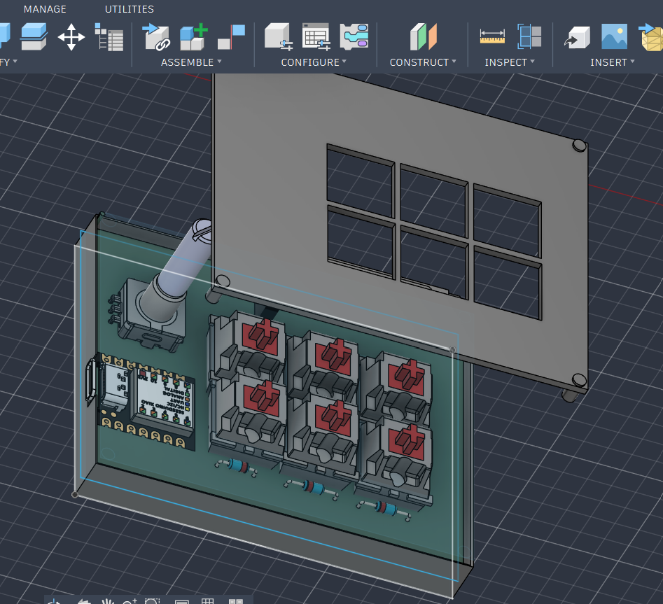

# SixPad

A compact, custom-designed screwless 6-key mechanical macropad built with a Seeeduino XIAO, a rotary encoder, a 128x32 OLED display, and powered by Python-based KMK firmware.

## Overall Macropad



## Schematic



## PCB Design



## Case & Assembly



## Bill of Materials (BOM)

- **Seeeduino XIAO:** 1x microcontroller
- **Mechanical Switches:** 6x switches
- **Rotary Encoder:** 1x encoder
- **OLED Display:** 1x 128x32 display
- **Case Parts:** 3D-printed top plate and bottom tray

## Repository Directory Structure

```text
├── CAD/
│   └── assembly.step
├── PCB/
│   ├── SixPad.kicad_pro
│   ├── SixPad.kicad_sch
│   └── SixPad.kicad_pcb
├── Firmware/
│   └── main.py
├── production/
│   ├── Top.STEP
│   ├── Bottom.STEP
│   ├── gerbers.zip
│   └── main.py
└── assets/
    ├── CAD.png
    ├── Schematic.png
    ├── PCB_layout.png
    └── case_assembly.png